# MODX IntelliSense

Intelligent MODX, pdoTools and fenom tooling for VS Code.

[](https://marketplace.visualstudio.com/items?itemName=gulomov.vscode-modx)
[](https://marketplace.visualstudio.com/items?itemName=gulomov.vscode-modx)
[](https://marketplace.visualstudio.com/items?itemName=gulomov.vscode-modx&ssr=false#review-details)
[](https://github.com/GulomovCreative/vscode-modx/actions/workflows/ci.yml)
[](LICENSE)


## Requirements

VS Code 1.81 or newer.

## Where it runs

Locally, and over Remote-SSH, Dev Containers, WSL and Remote Tunnels — there the
extension runs on the remote host against a real file system.

In the browser as well: github.dev, vscode.dev without a clone, and any other
virtual workspace. Files are addressed by URI rather than by path, so `@FILE`
completion, Go to Definition and the block names collected through `{extends}`
and `{use}` follow whatever scheme the workspace uses.

## Installation

- Press `F1` and run `Extensions: Install Extensions`.
- Search for `IntelliSense for MODX` and install it.

Or [install from the Visual Studio Code Marketplace](https://marketplace.visualstudio.com/items?itemName=gulomov.vscode-modx), or from a terminal:

```sh
code --install-extension gulomov.vscode-modx
```

## Features

### MODX Syntax Highlighting

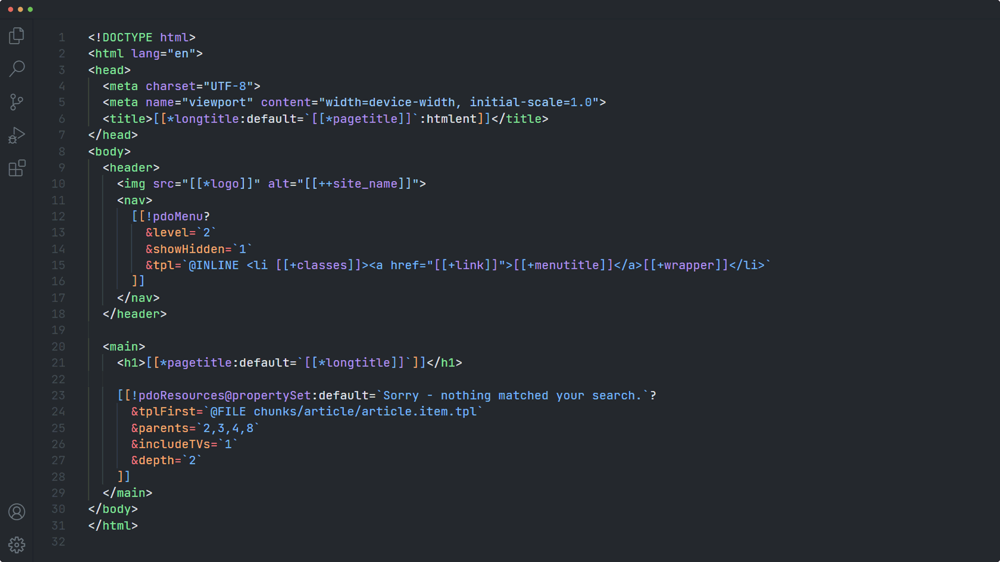

### MODX Autocomplete: Default Resource Content Field Tags

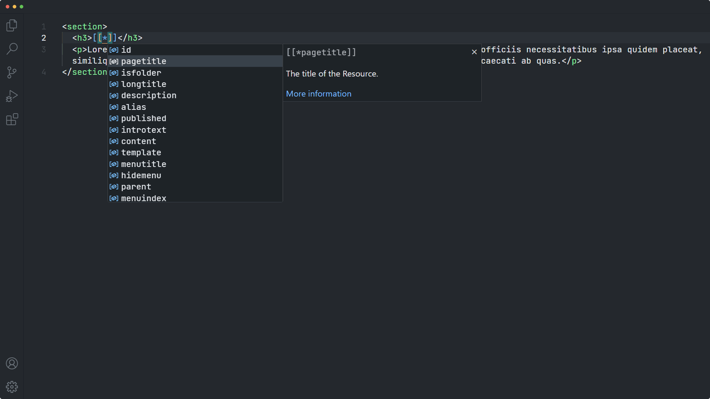

### MODX Autocomplete: System settings

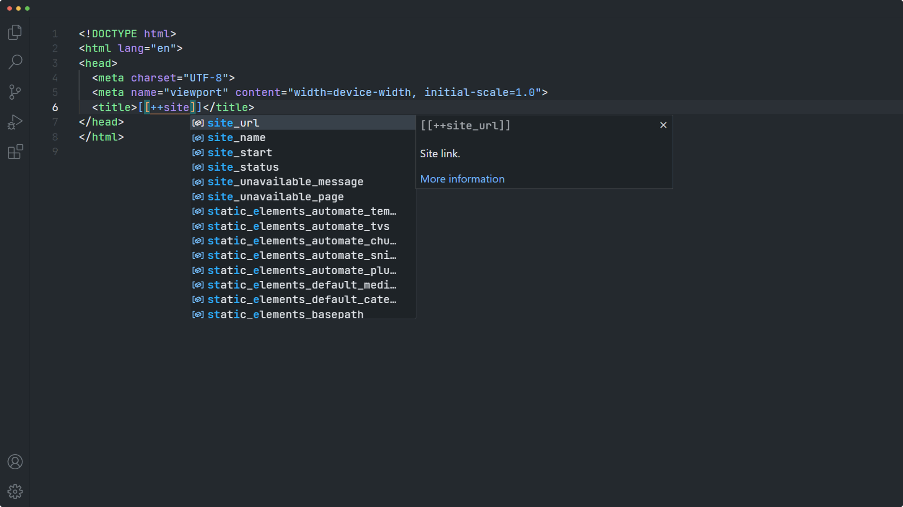

### MODX Autocomplete: fastField tags

Suggests [fastField](https://docs.modx.com/current/en/extras/fastfield) / [pdoParser](https://docs.modx.com/3.x/en/extras/pdoTools/Parser) tags after `#`:

- Resource fields: `[[#15.pagetitle]]`
- TV and properties prefixes: `[[#15.tv.name]]`, `[[#15.properties.key]]`
- PHP superglobals: `[[!#GET.key]]`, `POST`, `REQUEST`, `SERVER`, `FILES`, `COOKIE`, `SESSION`

### MODX Autocomplete: Chunk tags

Suggests a chunk tag after `$`: typing `$header` offers `[[$header]]`, and `!$header` offers the uncached `[[!$header]]`.

### MODX Autocomplete: Output filters/modifiers

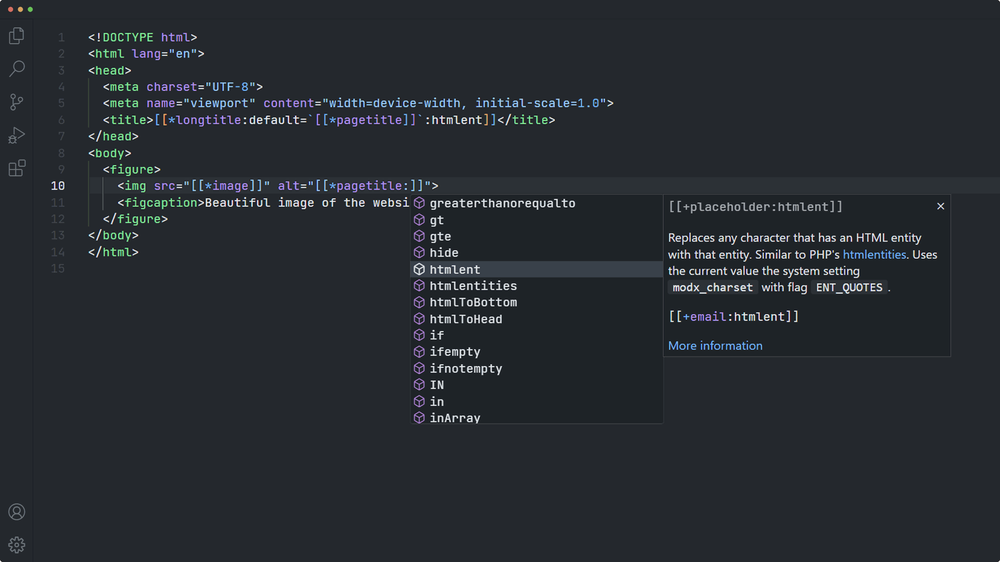

### MODX Autocomplete: Snippets and props

Note, autocomplete works with a list of predefined snippets:

- [pdoTools](https://extras.modx.com/package/pdotools) snippets
- [miniShop2](https://extras.modx.com/package/minishop2) snippets
- [FetchIt](https://extras.modx.com/package/fetchit)
- [FormIt](https://extras.modx.com/package/formit) snippets

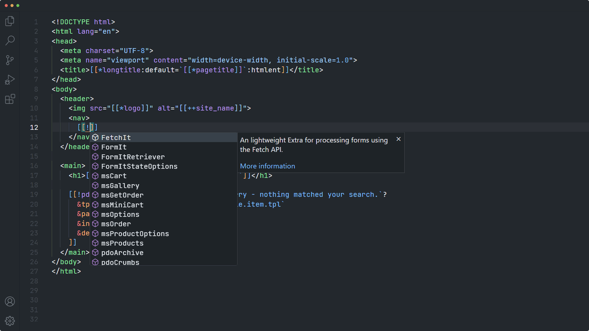

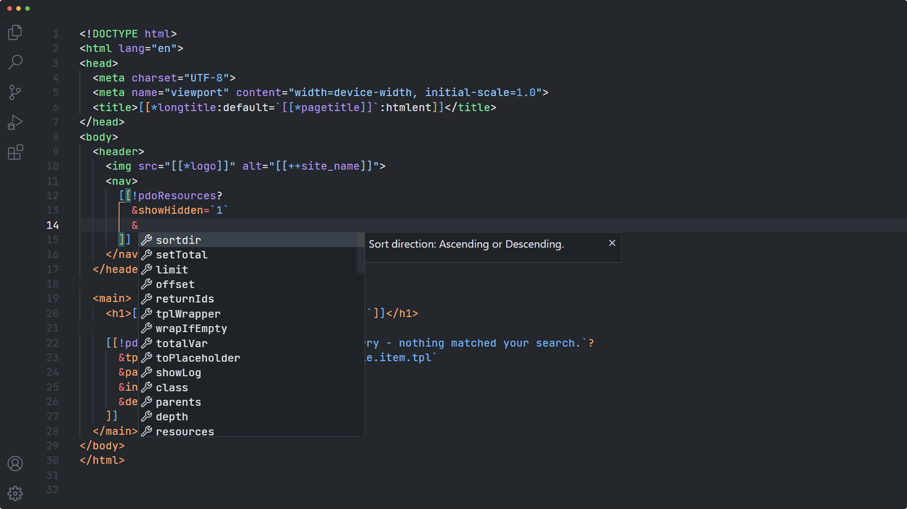

### MODX Autocomplete: @FILE binding paths

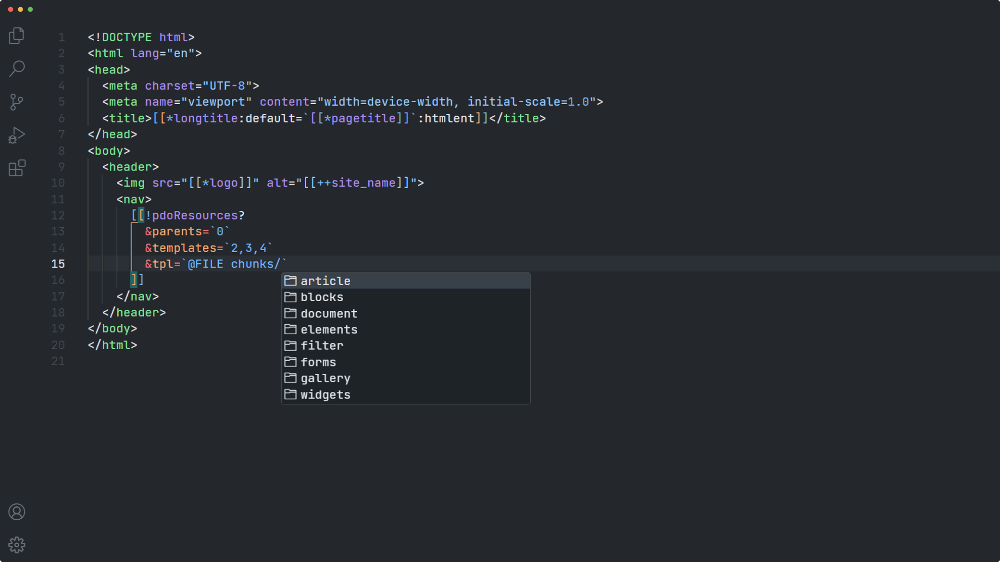

### Go to Definition: @FILE bindings

`Ctrl`/`Cmd` + click or `F12` on a path inside an `@FILE` binding opens that file. Works in both languages, and in Fenom also inside `$_modx->runSnippet('@FILE …')` and `{'@FILE …' | snippet}`.

### Fenom Syntax Highlighting

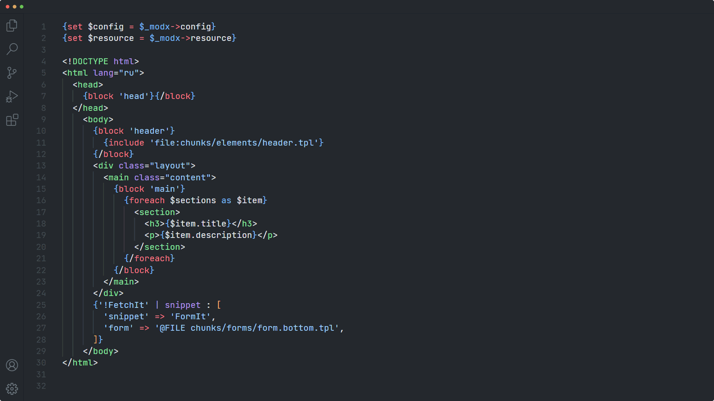

### Fenom Autocomplete: Tags

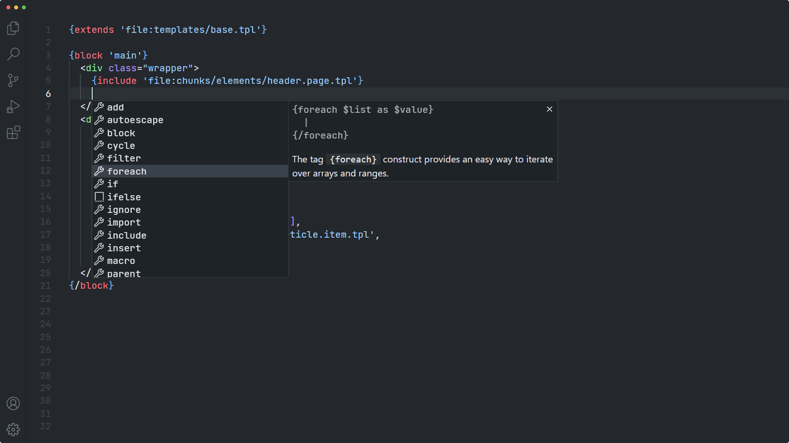

### Fenom Autocomplete: Block names

Suggests names from `{block '…'}` in the current file and in templates linked via `{extends}` / `{use}`, when typing inside `{paste '…'}`, `{block '…'}`, or `{$.block.…}`. The `{block}` tag itself is also suggested without a prior `{extends}` (parent templates).

### Fenom Autocomplete: `{foreach}` arguments and tag options

Inside `{foreach}`, its arguments `index`, `first` and `last` are suggested, and `@` after a variable offers the same as iteration properties: `{$item@index}`.

`:` right after a tag name offers the tag options `raw` and `ignore`: `{include:raw '@FILE …'}`.

### Fenom Autocomplete: Modifiers

- [Built In modifiers](https://github.com/fenom-template/fenom/tree/master/docs/en#modifiers)
- [pdoTools modifiers](https://docs.modx.pro/components/pdotools/parser#modifikatory)

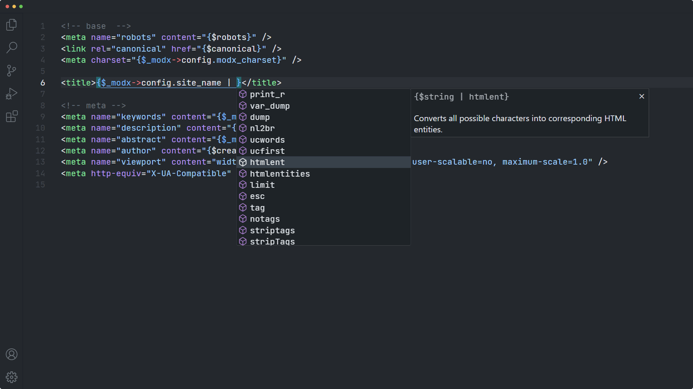

### Fenom Autocomplete: Variables

- [Fenom system variables](https://github.com/fenom-template/fenom/blob/master/docs/en/syntax.md#system-variable)
- pdoTools [microMODX class](https://github.com/modx-pro/pdoTools/blob/master/core/components/pdotools/model/pdotools/_micromodx.php)
- Local variables

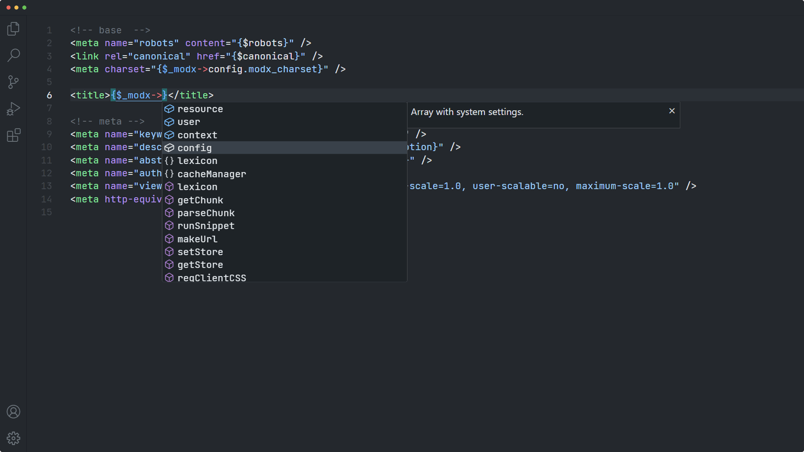

### Fenom Autocomplete: System settings

System settings are suggested inside the quotes in front of the `config` and `option` modifiers. In a bare `{'…'}` the modifier is offered together with the setting, so `{'site_name'}` completes to `{'site_name' | option}`.

### Fenom Autocomplete: Snippets and props

Note, autocomplete works with a list of predefined snippets:

- [pdoTools](https://extras.modx.com/package/pdotools) snippets
- [miniShop2](https://extras.modx.com/package/minishop2) snippets
- [FetchIt](https://extras.modx.com/package/fetchit)
- [FormIt](https://extras.modx.com/package/formit) snippets

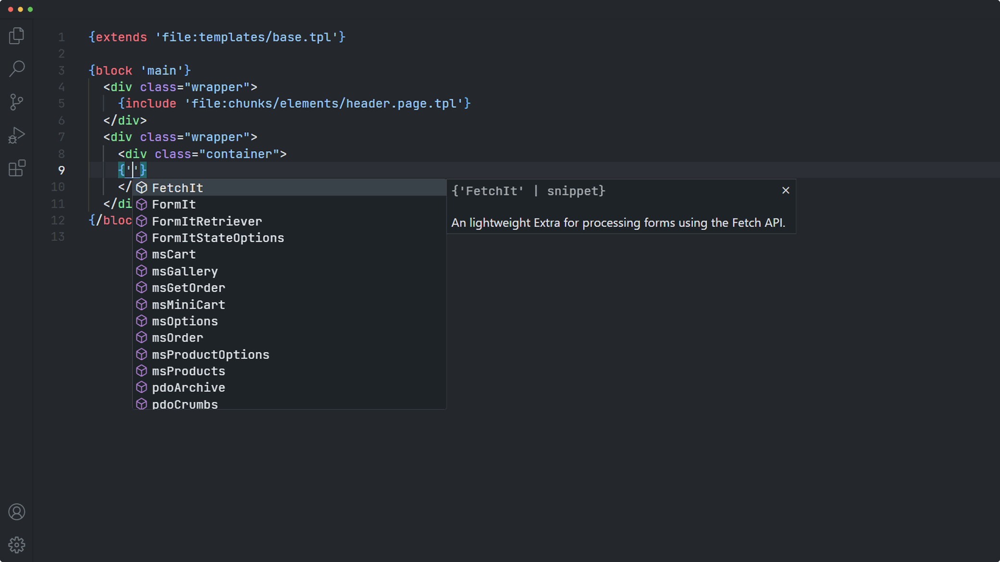

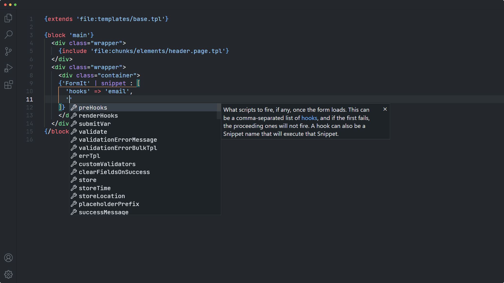

### Fenom Autocomplete: @FILE binding paths

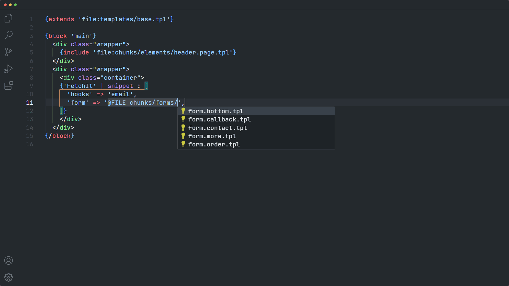

### Formatting

`Format Document` and `Format Selection` re-indent templates with the block
structure of both the markup and the template in mind: `{if}` / `{foreach}`
nesting, `{else}` branches whose markup need not be balanced inside a branch,
multi-line MODX property lists, and `{switch}` / `{case}`.

Only leading whitespace changes. Nothing is reflowed or rewritten, and the
contents of comments, `{ignore}` blocks, `<pre>`, `<textarea>`, `<script>` and
`<style>` are left exactly as they are.

## Extension Settings

### `vscode-modx.elementsPath`

Directory the `@FILE` paths are resolved against, relative to the workspace root. Default: `/core/elements/`.

```json
"vscode-modx.elementsPath": "/core/elements/"
```

Set it to `/`, `.`, or an empty string to browse from the project root — useful when templates live outside `core`, or when the editor is opened on the theme directory rather than on the MODX installation.

## Recommended VS Code Settings

### `files.associations`

Both languages register the `.tpl` extension, so use the `files.associations` setting to
tell VS Code which one to open `.tpl` files in:

```json
"files.associations": {
  "*.tpl": "modx",
  // or
  "*.tpl": "fenom",
}
```

The same setting turns the extension on for other file types. `.html` files keep the
built-in HTML mode by default, which leaves `resourceLangId == html` intact for Live
Server, Emmet and other extensions that key off the language id. Opt in per glob when you
store templates as `.html`:

```json
"files.associations": {
  "core/elements/**/*.html": "modx"
}
```

## Troubleshooting

### Problem: Emmet expand abbreviation doesn't work

Check the VSCode settings, note the `emmet.includeLanguages`, you need to add the following value:

```json
{
  "emmet.includeLanguages": {
    // ...
    "modx": "html",
    "fenom": "html"
  }
}
```

### Problem: TailwindCSS intellisense doesn't work

Add to your user/project/folder settings following value and make sure the `editor.quickSuggestions.strings` setting is enabled:

```json
{
  "tailwindCSS.includeLanguages": {
    // ...
    "modx": "html",
    "fenom": "html"
  },
  "editor.quickSuggestions": {
    // ...
    "strings": true
  }
}
```

## License

[MIT](LICENSE). Dependency license scanning is tracked by
[FOSSA](https://app.fossa.com/projects/git%2Bgithub.com%2FGulomovCreative%2Fvscode-modx?ref=badge_large).
