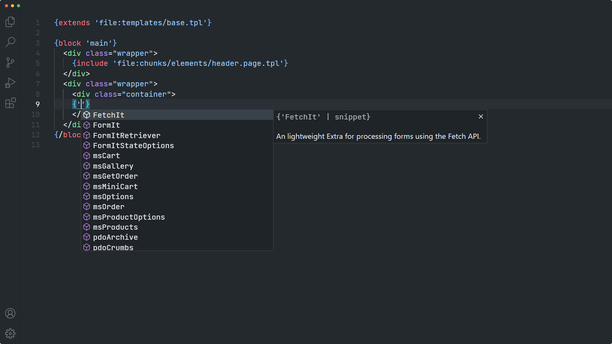

# MODX IntelliSense

Intelligent MODX, pdoTools and fenom tooling for VS Code.


## Installation

Plugin installation is performed in several stages:

- Press `F1` and select `Extensions: Install Extensions`.
- Search and choose `vscode-modx`.

Or [install via the Visual Studio Code Marketplace](https://marketplace.visualstudio.com/items?itemName=gulomov.vscode-modx).

## Features

### MODX Syntax Highlighting


[](https://app.fossa.com/projects/git%2Bgithub.com%2FGulomovCreative%2Fvscode-modx?ref=badge_shield)

### MODX Autocomplete: Default Resource Content Field Tags


### MODX Autocomplete: System settings


### MODX Autocomplete: Output filters/modifiers


### MODX Autocomplete: Snippets and props

Note, autocomplete works with a list of predefined snippets:

- [pdoTools](https://extras.modx.com/package/pdotools) snippets
- [miniShop2](https://extras.modx.com/package/minishop2) snippets
- [FetchIt](https://extras.modx.com/package/fetchit)
- [FormIt](https://extras.modx.com/package/formit) snippets


### MODX Autocomplete: @FILE binding paths


### Fenom Syntax Highlighting


### Fenom Autocomplete: Tags


### Fenom Autocomplete: Modifiers

- [Built In modifiers](https://github.com/fenom-template/fenom/tree/master/docs/en#modifiers)
- [pdoTools modifiers](https://docs.modx.pro/components/pdotools/parser#modifikatory)


### Fenom Autocomplete: Variables

- [Fenom system variables](https://github.com/fenom-template/fenom/blob/master/docs/en/syntax.md#system-variable)
- pdoTools [microMODX class](https://github.com/modx-pro/pdoTools/blob/master/core/components/pdotools/model/pdotools/_micromodx.php)
- Local variables


### Fenom Autocomplete: Snippets and props

Note, autocomplete works with a list of predefined snippets:

- [pdoTools](https://extras.modx.com/package/pdotools) snippets
- [miniShop2](https://extras.modx.com/package/minishop2) snippets
- [FetchIt](https://extras.modx.com/package/fetchit)
- [FormIt](https://extras.modx.com/package/formit) snippets




### Fenom Autocomplete: @FILE binding paths


## Recommended VS Code Settings

### `files.associations`

Use the `files.associations` setting to tell VS Code to always open .tpl files in MODX or Fenom mode:

```json
"files.associations": {
  "*.tpl": "modx",
  // or
  "*.tpl": "fenom",
}
```

## Troubleshooting

### Problem: Emmet expand abbreviation doesn't work

Check the VSCode settings, note the `emmet.includeLanguages`, you need to add the following value:

```json
{
  "emmet.includeLanguages": {
    // ...
    "modx": "html",
    "fenom": "html"
  }
}
```

### Problem: TailwindCSS intellisense doesn't work

Add to your user/project/folder settings following value and make sure the `editor.quickSuggestions.strings` setting is enabled:

```json
{
  "tailwindCSS.includeLanguages": {
    // ...
    "modx": "html",
    "fenom": "html"
  },
  "editor.quickSuggestions": {
    // ...
    "strings": true
  }
}
```


## License
[](https://app.fossa.com/projects/git%2Bgithub.com%2FGulomovCreative%2Fvscode-modx?ref=badge_large)